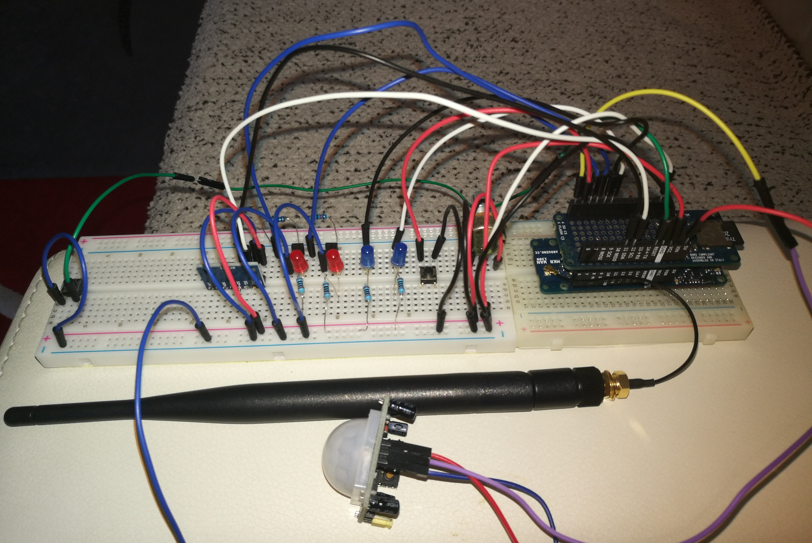

# Configurable and resource efficient framework for data and command transmission over LoRaWAN

LoRaWAN protocol is one of the over-the-air technologies that is emerging in the last years in the Internet of Things context due to key factors such as long-distance transmissions (excellent for installation in remote areas) and low power consumption.
Given however its recent development (2015), its potential has not yet been properly demarcated, and the LoRaWAN application area is mainly limited to the smart tracking or monitoring, where the classical scenario involves only the display of data sent from sensor devices.

In the academic and also industrial field, clear research gaps exist and one is due to the fact that no configurable and non-domain-specific tool has ever been engineered for dealing efficiently with devices of the embedded domain over LoRaWAN.
Therefore, this thesis work copes with this gaps and, based on a design science research process, illustrates the iterative steps that enabled the engineering of a framework artifact of prototypical nature for the embedded domain that permits the interaction with analog and
digital I/Os and with serial communication protocols (such as UART and I2C); in practical terms the framework was instantiated on a microprocessor-based device and was mounted on bredboard for testing purposes. Given the development with a problem-oriented process, key
questions such as configurability and efficiency in terms of quantity of data transmitted have been answered by providing methods and implementations within the framework design with the primary purpose of improving the overall λ knowledge in the LoRaWAN domain.

### Technologies used: C++, Arduino, LoRaWAN, The Things Network (TTN)

